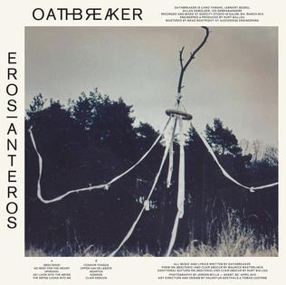

# Let's Try This with a LITTLE more gusto

[[toc]]

This is my second attempt at creating a blog. My original architecture was a half-baked solution that enabled me to develop some competencies in Spring Boot and Spring Cloud services. While it was a fun way to learn those development tools, this architecture seems to allow me to be more incremental with the enhancements that I give it and takes the complexity out of maintaining a full-stack app that's part CMS and part blog. If I'm going to be using a cms to journal my progress, I don't wnat to have to focus all of my writing on the technical implementation of this already better-solved problem. Given my goal of a simplified cms solution, I couldn't just keep it simple!

## Original Architecture

The original archictecture used a postgresql database configured using docker compose(stack) with a volume paired with a couple of container-ized spring boot 2 services and a Vue.JS frontend.

### Spring Services

The original application split the spring app into two services

- Oauth2-via-JWT Auth server
- Resource management server for the content management -
  - The Blog's various text elements
  - The posts

### Jenkins Deployment Pipeline

This was really your standard bitbucket-hooked deployment pipeline.

- Bitbucket tells my publicly available endpoint that I made a commit
- Jenkins pulls the newest code
- Jenkins tests new code
- Jenkins builds code and ssh's it to my server
- Run some systemctl commands and kick off some test-polls

### Features

The previous version has a built-in CMS for creating, editing and deleting content hidden behind an authenticated route. I used quill editor with some highlight.js for the added "Developer-blog Necessary" functionality. Even before I'd migrated to typescript, my app bundle just wasn't cutting it. Which, is part of why I wanted to just move this puppy over to a more light-weight solution. Holy guacamole.

## New Architecture - Vuepress & Typescript

This will be discussed in more detail in my next post, but I have a super basic vuepress app that has some nifty tricks for putting together UX features that I prefer for my web content presentation. Along with the technical implementation, I'll talk about some of the benefits of a statically rendered cms

## Moving Forward

### CI/CD

As I'd mentioned earlier, I wanted to migrate my app away from the overly-complex microservice orchestration + jenkins deployment automation and move towards something that took less effort. I think my next article will be the build pipeline for this current iteration of the blog.

### Layout Redesign w/ [Tailwind CSS](https://tailwindcss.com/)

As much as I adore all of the goodness that is the Vuejs docs design, I HAVE to do some redesign, so look out for more articles about integrating UI libraries with Vuepress and my take on the resources I've used.

### Vuepress Feature Enhancement

- Comments : I wanna be able to provide a space where others are able to interact with my content and each other.

- Media Consumtion Display and Aggregation Automation : I mostly just want somebody else to be able to know about all the sappy music I listen to (most recently: [Oathbreaker](http://theoathbreakerreigns.com/)'s "Eros|Anteros", [Have Mercy](http://www.wearehavemercy.com/)'s "The Earth Pushed Back", [Verse](https://myspace.com/verse)'s "Aggression" because THIS ISN'T NORMAL.

## Bonus - Friend Plugs

With any luck, I'll have some friends submit some content in the near future about cool shit they're working on.
