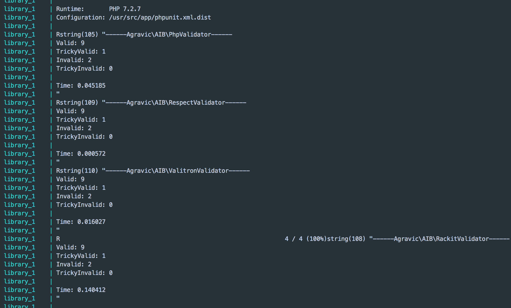

# Em Talks to [the Potential Employer] - Interview One and The Code Challenge

[[TOC]]
I always enjoy spending time getting to know how various companies approach IT operations. Sometimes, it's as simple as getting to know about the projects my friends or colleagues are wroking on. Other times, I get the honor of going through the process of interviewing with a potential employer or client. I LOVE this. It's like dating; all parties are interested in seeing if they would enjoy being supported by each other in their needs for the immediate, middle, and long-term future and what that relationship may look like.

## Interview Two - The Code Challenge

This is often a more technical interview. Leading up to my next interview I've been given the challenge of creating a solution that performs an email validation without relying on the language-specific validation implementation (e.g. [Basic Validation in Php](https://www.w3schools.com/php/php_form_url_email.asp)) or regular expressions.

This leads me to believe that they're most interested in how I evaluate various solutions (because now I can't use the obvious approach) and how I can exhibit the validity of my solution as it relates to the roles and responsibilities of the job:

## Problem Context

I'm using the job description and some of the information I gathered from our first interview to determine what skills are most important to showcase in how I approach this solution. Given the following role information, I've decided to focus on building a modular solution that's easily extended for other use cases, easily imported to be included in new features, and easily updated, maintained, and distributed using modern DevOps standards:

> As a Senior Developer you will be a core member of the Tech Department and will be responsible for maintaining existing systems as well as implementing new features and technologies. You will be working on projects of various sizes, some of which you may solely be responsible for coding or some of which you will need to work in tandem with other developers. Excellent communication skills are required as you will be involved in the design of new projects and often will need to work closely with members of other departments. **Other responsibilities may include code review for functionality, code debugging, troubleshooting issues with users and analysis data requests**. The ability to adapt and figure out solutions to challenging problems with regard to deadlines is a must.

> The ideal candidate will have a great work ethic and will be detail oriented. The ability to work independently while also functioning and contributing as part of a team is essential to being successful in this role.

Required Skills:

- Understanding and knowledge of DevOps
- Strong knowledge of PHP/MySQL/Postgresql
- Minimum 2 years experience on LAMP environment
- Minimum 1 year experience using AWS, admin experience not required
- Strong knowledge of HTML technologies and web frameworks
- Excellent communication skills

Preferred Skills:

- User interface development experience using languages such as CSS, HTML/HTML5, JavaScript, or JSON
- Python
- Business/Management experience
- NoSQL

## Acceptance Criteria

##### Must Haves

- DevOps

  - Codegen
  - Documentation
  - Containerized packaging for sharing

- Features
  - Test for basic functionality
  - Error handling
  - Don't use regex
  - Don't use php filter_var method
  - Implements language standards

::: tip
When implementing standards, do what you can to answer these questions:

1.  Is there an internal library for this already?
2.  What other functionality should a new feature support(what context-specific interfaces will this have?) E.g. How is exception handling performed? How is logging performed?
3.  How would this feature and its clients' functionality be described using nouns and actions and how does this identify the state and functionality of this feature? -> Use this to define components and sub-components
4.  How is logging performed? (see 2)
5.  How is testing performed? (see 2)

:::

## The Must Have Solution

1.  Given the specification of the coding challenge, I am pretending as though this is not implemented in any given language and that I have chosen to use PHP as a result of it being one of the primary languages used by my interviewing company. Were this an IRL consideration, I'd:

- Look to the packages that are being used internally in the various languages and systems currently implemented
- Find where there are opportunities to leverage other code based on the consideration of its current test completedness/the time it would take to implement tests, how the system/language relates to the system/language that requires the new functionality, and use this as a LOE and technical cost(debt, reources, time and knowledge, for development and maintenance) baseline for connecting the features/libraries.
- Look at which languages solve it best if the solution is one that is likely to become a service suite - a fast implementation of a microservice shouldn't be difficult given the right system ecosystem
- Use the technical cost and LOE metrics to determine which solution will sufficiently solve the problem

2.  (and 3.) Using the basic understanding of validation libraries and wanting to provide a common interface for the performance of different validations and abstract which library is supporting which kinds of validations, I implemented a validator factory for the various email validations and created the interfaces Validatable and Validator. The validatable class is also the implemented use case for performing codegeneration.
3(4).  Exception throwing is currently performed by the validatable classes - validation libraries, by nature, should always return true or false for validity and any error that occurs during validation should meet the case of an "invalid" evaluation. Since my solution abstracts various libraries and implementations for validation, I've chosen to throw Exceptions in places where runtime errors may have inadvertently not provided the precondition "value" for validation

##### Nice to haves

DevOps

- Composer package for package sharing
- Static Code analysis
- Code linting
- Git hooks

  - Lint and analyze on commit
  - Generate Docs on commit

Features

- Service Metrics Logging
  - Uptime
  - Requests
  - Monitoring
- Metrics Archival - PostgreSQL
- Metrics Visualization using Python and Javascript for Data Visualization
- Deploy to aws using CI/CD pipeline provided by VSTS

## Conclusion

Having considered - 
- [Respect](https://github.com/Respect/Validation)
- [Valitron](https://github.com/vlucas/valitron)
- [Rakit](https://github.com/rakit/validation)

Given the performance and low-overhead of implementation of the Respect Validation library and its github metadata, I am suggesting that the library to roll with is Respect as it outperforms all other solutions.

